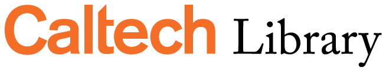

| A workshop inspired by | Sponsored by |
|  |  |

#### June 13, 14 and 16, 2022

## Introduction

This workshop provides a brief introduction to Natural Language Programming using Python.
It covers text manipulation and processing using core Python functions, as well as the 
NLTK and spaCy programming libraries.

The workshop is limited to the processing of text, and does not include speech recognition
or speech processing. Topics covered include the manipulation of text, word contexts and
frequency distribution, parts of speech, named entities, and sentiment analysis.

During COVID the workshop is taught online in three one-hour sessions. Ideally, the workshop
would be taught in person, in three two-hour sessions, with time for exercises and discussion.

## Setup

The workshop assumes use of a Jupyter Notebook to run code examples. JupyterLab, Jupyter Notebook, and Google Colab are all 
good options. JupyterLab and Jupyter Notebook can be downloaded as part of the [Anaconda data science suite](https://anaconda.com).
Google Colab in a cloud-based Jupyter Notebook implementation.

### Google Colaboratory

We will be using Google Colaboratory ("Colab") to run code in this workshop. Colab is a free Jupyter Notebook environment
that runs in the cloud and stores its notebooks on Google Drive. To use Colab you will need to sign in to a Google account. 
(Note: Caltech Google accounts do not provide access to Colab. You will need to use a personal account.)

An introduction to Google Colab is available here: [https://research.google.com/colaboratory/](https://research.google.com/colaboratory/)

Before the workshop please confirm that you have a Google Account with access to Colab.

## Contents

1. [Text processing in Python](python-strings.md)
    + 1.1 Strings and their properties
    + 1.2 Strings as iterables
    + 1.3 Lists
    + 1.4 Comparing and searching strings
    + 1.5 Regular expressions

2. [NLTK](nltk.md) (Natural Language Toolkit)
    + 2.1 Text preprocessing (spellchecking, stemming and lemmatization)
    + 2.2 Word contexts and frequency distribution
    + 2.3 Parts-of-speech tagging
    + 2.4 Named entity recognition
    + 2.5 Sentiment analysis

3. [spaCy](spacy.md)
    + 3.1 Statistical modeling of text
    + 3.2 Word vectors and similarity
    + 3.3 Processing pipelines

4. [Selected Resources](resources.md)
