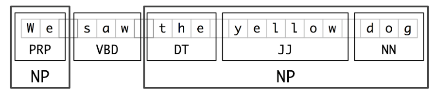

## 2. NLTK

- 2.1 [Acquiring a text](#acq)
- 2.2 [Text preprocessing](#preprocessing)
- 2.3 [Word contexts and frequency distribution](#freq)
- 2.4 [Parts-of-speech tagging](#pos)
- 2.5 [Named entity recognition](#ner)
- 2.6 [Sentiment analysis](#sa)

### <a name='acq'/>2.1 Acquiring a text

There are many different ways to acquire a text for processing. The text may already be in text form, 
in a file stored on your computer. Or an HTML-encoded file on the web. Or an audio or video file. 
Or a scan of a handwritten image. There are increasingly sophisticated and successful ways for recognizing 
and transcribing texts from images, audio, and video formats, and we will assume that that type of 
processing has already taken place.

Here is code for storing a file locally:

```python
# assign a text to a variable, `title`
title = 'A Town Called Alice'

# open a file for writing, assign to variable `f`
with open('demofile.txt', 'w') as f:
  f.write(title)
  
# open a file for appending, assign to variable `f`
with open('demofile.txt', 'a') as f:
  f.write(', by Nevil Shute')
  
# open a file file reading, assign to variable `f`
with open('demofile.txt', 'r') as f:
  title2 = f.read()
  
print('Title:', title)
print('Title with author:', title2)
```

Note the attributes 'w', 'a' and 'r' for 'write' (i.e. overwrite, create), 'append', and 'read' on the open function.
Also, the file is automatically closed at the end of each `open()` code block.

For reading text from the web we will use the `request` method from the `urllib` library to download the text of 'Origin of the Species'
from [Project Gutenberg](https://www.gutenberg.org/). We will use this version: [The Origin of Species by Means of Natural Selection by Charles Darwin (6th. ed.)](https://www.gutenberg.org/ebooks/2009), the [plain text UTF-8 version](https://www.gutenberg.org/cache/epub/2009/pg2009.txt).

We only need one method from the `urllib` library: `request`

```python
from urllib import request
```

Let's assign the URL to a variable, use the `request()` to create a request object that provide access to the URL, 
and the `read()` method to read the contents of the URL to a file:

```python
url = 'https://www.gutenberg.org/cache/epub/2009/pg2009.txt'
req = request.urlopen(url)
origin_byt = request.urlopen(url).read()
```

These code above can actually be collapsed into one:

```python
from urllib import request
origin_byt = request.urlopen('https://www.gutenberg.org/cache/epub/2009/pg2009.txt').read()
```

Print our the first 50 characters of origin_text:

```python
print(origin_byt[:100])
```

You should see the following:

```
b'\xef\xbb\xbfThe Project Gutenberg eBook of On the Origin of Species, by Charles Darwin\r\n\r\nThis eBook is for t'
```

There are things here that need explaining, including escape sequences and characters, denoted by the
backslash: `\`

Here's what the extra codes mean:

| code | meaning |
| --- | --- |
| leading `b` | this is a `byte` object, and not a `string` object |
| `\xef\xbb\xdf` | the character encoding is UTF-8 |
| `\f` | form feed |
| `\r` | carriage return |
| `\n` | line feed (new line) |

Other codes you will encounter:

| code | meaning |
| --- | --- |
| `\t` | tab |
| `\b` | backspace |
| `\uxxxx` | character with 16-bit hex value 'xxxx' |
| `\Uxxxxxxxx` | character with 32-bit hex value 'xxxxxxxx' |
| `\N{name}` | character named 'name' in the Unicode database |

Use the `decode('utf-8-sig')` method to turn byte object into a string object without the leading 'signature' codes, and verify that it is a string: 

```python
origin_txt = origin_byt.decode('utf-8-sig')
print('type of origin_byt:', type(origin_byt))
print('type of origin_txt:, type(origin_txt))
print('beginning of origin_txt:', origin_txt[:100])
print('length of origin_txt':, len(origin_txt), 'characters')
```
By examining the beginning and end of the text on the Project Gutenberg website we know that the text begins after:

`*** START OF THE PROJECT GUTENBERG EBOOK ON THE ORIGIN OF SPECIES ***`

and ends with:

`*** END OF THE PROJECT GUTENBERG EBOOK ON THE ORIGIN OF SPECIES ***`

so we can trim the text as follows:

```python
s1 = '*** START OF THE PROJECT GUTENBERG EBOOK ON THE ORIGIN OF SPECIES ***'
s2 = '*** END OF THE PROJECT GUTENBERG EBOOK ON THE ORIGIN OF SPECIES ***'
startpos = origin_txt.find(s1) + len(s1)
endpos = origin_txt.rfind(s2)
origin_txt = origin_txt[startpos:endpos]
```

> **An aside:** List comprehensions.

List comprehensions are a Python technique for transforming a list. They are generally
very fast and efficient, and a better option than writing multi-line code. 

For example, consider this list:

```python
title = ['On', 'the', 'Origin', 'of', 'Species', 'BY', 'MEANS', 'OF', 'NATURAL', 'SELECTION']
```

This comprehension simply replicates the list:

```python
[word for word in title]
```

However, we can normalize the list like this:

```python
title_words_norm = [word.lower() for word in title if len(word) > 2]
```

### <a name='preprocessing'/>2.2 Text preprocessing

The type of preprocessing you will do for a project will depend on the objectives.
If we are only interested in building a list of words, a vocabulary, then this is
a fairly common type of preprocessing:

```python
import nltk
from nltk.tokenize import word_tokenize
from nltk.corpus import stopwords
nltk.download('stopwords')
from string import punctuation

words = word_tokenize(origin_txt, language='english')

words = [token.lower() for token in tokens] # lowercasing all words
words = [token for token in tokens if not token.isdigit()] # removing any tokens that are only digits 
words = [token for token in tokens if token not in punctuation] # remove punctuations
mystopwords = set(stopwords.words("english"))
words = [token for token in tokens if token not in mystopwords] # removes stopwords
words = [token for token in tokens if len(token) > 3] # remove tokens with fewer than four characters
```

Our `words` list includes a normalized list of words: all lowercase, without numbers, punctuation, stopwords,
or short words.

For grammatical analysis, or sentiment analysis, we would likely want to keep all the words,
as well as the sentence structure.

### <a name='freq'/>2.3 Word contexts and frequency distribution

Creating an NLTK text object from the text allows us to examine word contexts and frequency distribution.
For this we will use the original text:

```python
origin_tokenized = word_tokenize(origin_txt, language='english')
text = nltk.text.Text(origin_tokenized)
```

We can use this NLTK text object to examine characteristics of the text.
The concordance method shows the context of words in the text:

```python
text.concordance('species')
text.concordance('human')
text.similar('species')
text.dispersion_plot(['modification', 'change'])
```

We can use the frequency distribution method to examine word usage:

```python
from nltk import FreqDist
fdist_text= FreqDist(words)
fdist_text
fdist_text.most_common(50)
fdist_text.plot(20, cumulative=True)
```

### <a name='pos'/>2.4 Parts-of-speech tagging

NLTK provides a part-of-speech (POS) tagger called the 'averaged perceptron tagger' (among others).
'punkt' is used to inform the sentence and word tokenization.

```python
import nltk
from nltk.tokenize import word_tokenize
from nltk.tag import pos_tag
nltk.download('punkt')
nltk.download('averaged_perceptron_tagger')
nltk.download('maxent_ne_chunker')
nltk.download('words')
```

Let's take a text from the Caltech website, and preprocess it::

```python
text = '''Founded in 1891, Caltech is a world-renowned
science and engineering institute that marshals
some of the world’s brightest minds and most
innovative tools to address fundamental scientific
questions and pressing societal challenges. An
independent, privately supported institution
located in Pasadena, California, Caltech also
manages the Jet Propulsion Laboratory (JPL),
located 6 miles north of campus, for NASA.'''

text = word_tokenize(text)
text = pos_tag(text)
print(text)
```

You can find a table of the POS abbreviations here: 
[https://www.guru99.com/pos-tagging-chunking-nltk.html](https://www.guru99.com/pos-tagging-chunking-nltk.html)

There is a lot more you can do, but we will discuss it further in the context of spaCy.

### <a name='ner'/>2.5 Named entity recognition

Named entity recognition is the process of grouping, or 'chunking', words and recognizing them as a single entity.
This is 'named entity recognition. This diagram illustrates the idea:



We will use the pre-trained NLTK chunker, 'ne_chunk'.

```python
ner_text = nltk.ne_chunk(text)
print(ner_text)
```

### <a name='sa'/>2.6 Sentiment analysis

Sentiment analysis (or opinion mining) is the use of NLP, 
text analysis, computational linguistics, and biometrics to systematically identify, extract, quantify, and 
study affective states and subjective information. Sentiment analysis is widely applied to reviews and survey responses, 
online and social media, and healthcare materials for applications that range from marketing to customer service to clinical medicine.

We will use two text corpora that come bundled with the NLTK to explore sentiment analysis, twitter samples and movie reviews.
We also initialize NLTK's 'Sentiment Intensity Analyzer', which will use a pretrained algrorithm, VADER, to product sentiment scores.

```python
import nltk
nltk.download(['twitter_samples', 'movie_reviews', 'vader_lexicon'])
from nltk.sentiment import SentimentIntensityAnalyzer
sia = SentimentIntensityAnalyzer()
sia.polarity_scores("I love the Library!")
```

The four scores returned are measure of negative, neutral, position sentiment, and a compound score.

The method `nltk.corpus.twitter_samples.strings()` returns the 30,000 twitter samples.
We can:

- put them into a list, disabling the URLs for safety
- create a pandas dataframe from the list
- add a column containing the sia scores, and each of the component scores

```python
import pandas as pd

tweets = [t.replace("://", "//") for t in nltk.corpus.twitter_samples.strings()]
df = pd.DataFrame(tweets, columns=['tweet'])
df['sia'] = df['tweet'].apply(lambda x: sia.polarity_scores(x))
df['neg'] = df['sia'].apply(lambda x : x['neg'])
df['neu'] = df['sia'].apply(lambda x : x['neu'])
df['pos'] = df['sia'].apply(lambda x : x['pos'])
df['compound'] = df['sia'].apply(lambda x : x['compound'])
```

In this particular example we do not know how accurate the analysis is. Let's look at an example
with positive and negative sentiment already assigned: the movie reviews.

The reviews are assigned ids that include their positive and negative rating. We first need to:

- acquire a full list of the ids
- create a dataframe
- import the texts into the dataframe
- import the classification of each movie

```python
positive_review_ids = nltk.corpus.movie_reviews.fileids(categories=["pos"])
negative_review_ids = nltk.corpus.movie_reviews.fileids(categories=["neg"])
all_review_ids = positive_review_ids + negative_review_ids

df_reviews = pd.DataFrame(nltk.corpus.movie_reviews.fileids(), columns=['id'])
df_reviews['text'] = df_reviews['id'].apply(lambda x: nltk.corpus.movie_reviews.raw(x))
df_reviews['classification'] = df_reviews['id'].apply(lambda x: 0 if x[:3]=='neg' else 1)

df_reviews
```

Sentiment analysis is much more effective on short texts, so we should measure the sentiment
of individual sentences in each review and then sum them, rather than running the analyzer on
the entire review. Here is a function to find the mean score for a review and return either '1' (for positive)
or '0' (for negative). `sent_tokenize` is NLTK's tool for tokenizing by sentence.

```python
from statistics import mean
def sa_reviews(text):
  scores = [sia.polarity_scores(sentence)["compound"] for sentence in nltk.sent_tokenize(text)]
  if mean(scores) > 0:
    return 1
  else:
    return 0
```

We can use this to:
- add a 'score' column to the dataframe
- add a 'match' column to indicate whether our assigned classification matches the existing one

```python
df_reviews['score'] = df_reviews['text'].apply(sa_reviews)
df_reviews['match'] = df_reviews.apply(lambda x: 1 if x['score']==x['classification'] else 0, axis=1)

df_reviews
```

We know that there are 2000 reviews (1000 positive, 1000 negative), so we can compute the accuracy 
of our classification:

```python
accuracy = df_reviews['match'].sum()/2000
```

A match of 64% actually isn't too bad. It's not great either!

The next step would be to develop more specific 'features' from the data and to use machine learning 
algorithms to learn from the data, rather than using a generic, pre-trained tool.

---

##### \< [1. Text Processing in Python](python-strings.md) \| [3. spaCy](spacy.md) \>


