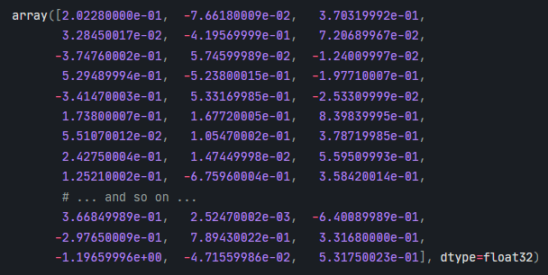

## 3. spaCy

- 3.1 [Introduction to spaCy](#spacy)
- 3.2 [Processing pipelines](#pipe)
- 3.3 [Text modelling](#model)
- 3.4 [Word vectors and similarity](#vec)
- 3.5 [scispaCy](#sci)

### <a name='spacy'/>3.1 Introduction to spacy

spaCy is an open source Python library for Natural Language Processing with a focus on rapid development 
and production usage. Here is an example of spaCy code to extract 'entities' from a text:

```python
import spacy                        # import the spaCy library
nlp = spacy.load('en_core_web_sm')  # load the processing pipeline
text = ("Founded in 1891, Caltech is an "
        "independent, privately supported institution "
        "located in Pasadena, California. Caltech also "
        "manages the Jet Propulsion Laboratory (JPL), "
        "located 6 miles north of campus, for NASA.")
doc = nlp(text)                     # create an nlp object named `doc`
for ent in doc.ents:                # read the 'entities' and their labels, from `doc`
  print(ent.text, ent.label_)
```
##### (GPE = 'Geopolitical entity')

In its most basic form a spaCy application can be very short, but a lot of processing steps take place,
and a lot more information is contained within the `doc` object.

### <a name='pipe'/>3.2 Processing pipelines

We can list the contents of the processing pipeline with:

```python
print(nlp.pipe_names)
```

This will list the default pipeline components, in the order in which they are used:

| tok2vec | Assign token-to-vector embeddings |
| tagger | Assign part-of-speech-tags |
| parser | Assign dependency labels |
| attribute_ruler | Assign token attribute mappings and rule-based exceptions |
| lemmatizer | Assign base forms to words using rules and lookups |
| ner | Assign named entities |

##### (from: [https://spacy.io/usage/processing-pipelines#pipelines](https://spacy.io/usage/processing-pipelines#pipelines)

If your result is a shorter list of pipeline components then you are likely not using the most recent version of spaCy.

Here is some of the information that is available from the `nlp` object:

```python
import pandas as pd
attribs = []
for token in doc:
  attribs.append([token.text, token.lemma_, token.pos_, token.tag_, token.dep_,
            token.shape_, token.is_alpha, token.is_stop])
df = pd.DataFrame(attribs, columns=['text', 'lemma', 'POS', 'tag', 'dependency', 'shape', 'alpha', 'stop'])
df
```

##### (There is a full list of token attributes here: [https://spacy.io/api/token#attributes](https://spacy.io/api/token#attributes))

### <a name='model'/>3.3 Text modelling

There are three main types of text models used in NLP: rules-based models, statistics-based models, and neural network-based models. The second two of these both fall into the category of machine learning, but nerual networks (or deep learning) required a lot more RAM and processing power. On the other hand, they can be very effective, and are increasingly the norm for natural language processing. A variety of different statistical and neural network models can be imported into the spaCy pipeline. They generally 

The various components of spaCy's processing pipeline are drive by statistical models. Decisions are about parts of speech, named entities, etc. based on previous training on texts where those labels have already been assigned.

There are a variety of different types of models available in spaCy--and [related projects](https://spacy.io/universe)--and are installed
in spaCy as Python packages. The [list of the available models in various languages](https://spacy.io/models/en) provides details about their sources, supported pipeline components, whether they contain word vectors or not (see below), and the labels used in the tagging.

The naming convention for the models is: lang_type_genre_size. 'core' models support tagging, parsing, lemmatization 
and named entity recognition, while 'dep' models are only for tagging, parsing and lemmatization. The two genres are 
'web' or 'news', and sizes are 'sm', 'md', 'lg', and 'trf' (for transformer). Transformer models use neural network 
techniques and are the largest and most resource heavy. 'sm' and 'trf' models do not include word vectors. 
For instance, there are four German models: de_core_news_sm, de_core_news_md, de_core_news_lg, and de_dep_news_trf; 
and four English models: en_core_web_sm, en_core_web_md, en_core_web_lg, and en_core_web_trf.
Sizes of the English models are 12 MB, 31 MB, 382 MB, and 438 MB respectively.

Here is a German example:

```python
import spacy
nlp = spacy.load("de_core_news_sm")
doc = nlp("Inzwischen war seine Frau Minna am 25. Januar 1866 in Dresden gestorben.") # 'Meanwhile, his wife Minna, had died on January 25, 1866 in Dresden.'
for entity in doc.ents:
    print(entity.text, entity.label_)
for token in doc:
    print('\nToken:', token.text, 
          '\nLemma:', token.lemma_, 
          '\nPOS:', token.pos_, 
          '\nStopword?:', token.is_stop)
```

### <a name='vec'/>3.4 Word vectors and similarity

As noted above, the smaller models do not include word vectors. A word vector is a multi-dimensional (e.g. 300 dimensions) vector
representation of the meaning of a word. Each dimension can be thought of as representing some dimension of the concept that the word
represents, but because the vectors are usually computationally derived in a complex way, using machine learning techniques for example,
what each dimension represents is not possible to describe. But the "proof of the pudding is in the eating", as the proverb does.

Here is what a word vector looks like:



The similarity of words, phrases and documents can be estimated using word vectors. Similarity is measured by the 'angle'
between the vectors in the n-dimensional space.

```python
import spacy

nlp = spacy.load("en_core_web_md")  # use md or lg packages
doc1 = nlp("The Caltech Library has a new website.")
doc2 = nlp("Access to online journals is essential.")

website = doc1[6]
online_journals = doc2[2:4]
print(website, "<->", online_journals, website.similarity(online_journals))
```

### <a name='sci'/>3.5 sciSpaCy

As noted above, there are [many projects](https://spacy.io/universe) based on spaCy. [scispaCy](https://allenai.github.io/scispacy/)
a package containing models for processing biomedical, scientific or clinical text, developed at the [Allen Institue for AI](https://allenai.org/) in Seattle. 

> **Exercise:** With a biomedical text of your choice, try the [scispaCy demonstration](https://scispacy.apps.allenai.org/)

---

##### \< [2. NLTK](nltk.md) \| [4. Resources](resources.md) \>

